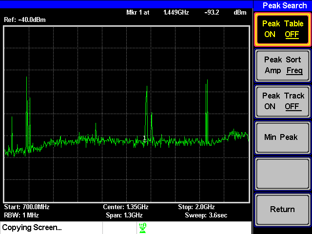
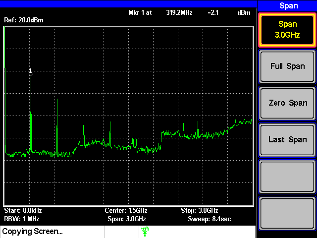
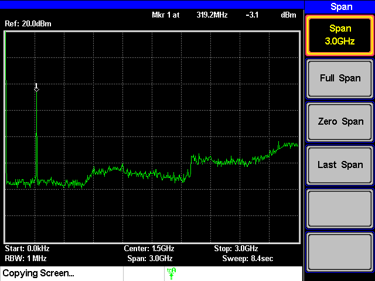
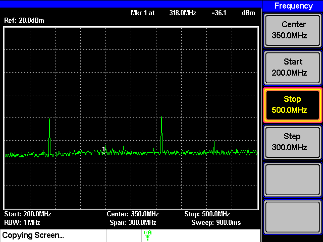
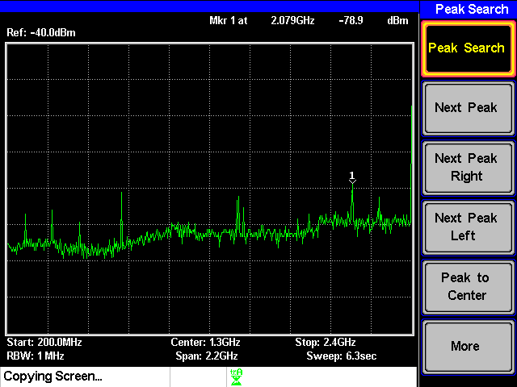

# AM変調
3I14 公文健太

# 共同実験者
3I04 市川 敬士
3I24 中川 寛之
3I34 藤原 魁

## 目的
AM 変調の送受信実験を通じて、高周波機器および計測器の取り扱いについて学ぶ

## 課題1
> 各自が使用している携帯電話の使用周波数を、スペクトラム・アナライザを用いて確認せよ(結果は、周波数のみ示せばよい)

- 結果  
    周波数は1.449[GHz]だった  
    

- 考察
    送信、受信ともにau回線を利用しており、auのLTEでの主要バンドに1.5Ghz帯が存在するためこの結果となったと考えられる  
    出典:[au携帯電話などの対応周波数帯一覧](https://www.au.com/support/service/mobile/procedure/simcard/unlock/compatible_network/)

## 課題2
> 信号発生器(XCO0320)の出力波形の周波数スペクトルおよび、それにバンドパスフィルタ(BPF0320)を付けた場合の出力を、スペアナで観測する

- 結果  
        - 信号発生器の出力波形  
        

        - バンドパスフィルタをつけた場合  
        

## 課題3
> 一段目のミキサ(MIX0400u)までを組み立て、その出力の周波数スペクトルをスペアナで観測せよ

- 結果  
    

## 課題4
> 送信側のモジュールを完成させ、スペアナでアンテナからの送信波の周波数スペクトルを確認せよ

- 結果  
    周波数は`a`[Hz]だった  
    

## 課題5
> AM変調の送受信実験を行う

- 結果  

## 考察
> 各モジュールの入力前後でスペアナの出力(周波数スペクトル)がどのように変わるかに注目して、各モジュールの働きについて理解すること。

AM変調・復調の実験を通じ、搬送波や側波帯がどのように信号を伝送する役割を果たすかを具体的に理解できた。また、スペクトラム・アナライザを用いて周波数スペクトルを観測することで、理論通りの結果を確認し、フィルタやミキサの役割も学んだ。さらに、信号処理が正確な通信に不可欠であることに気づいた。この実験を通じて、AM変調技術が現代の通信技術の基盤となる重要性を実感することができきた。