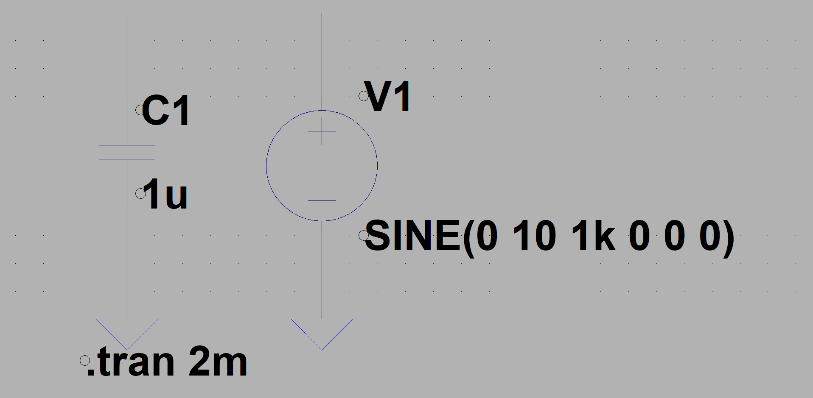
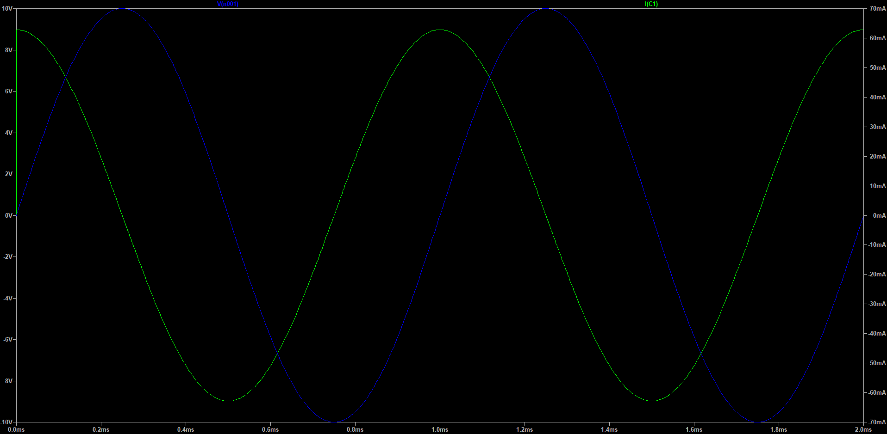
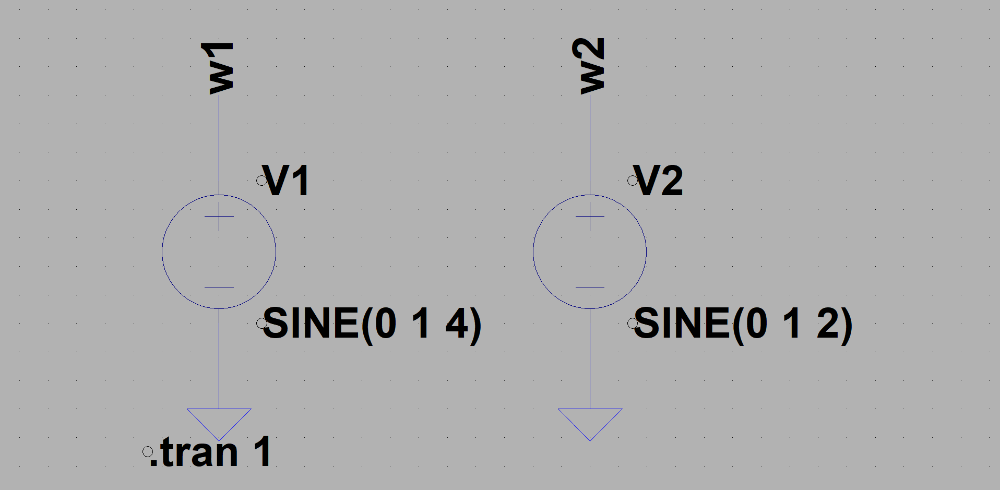
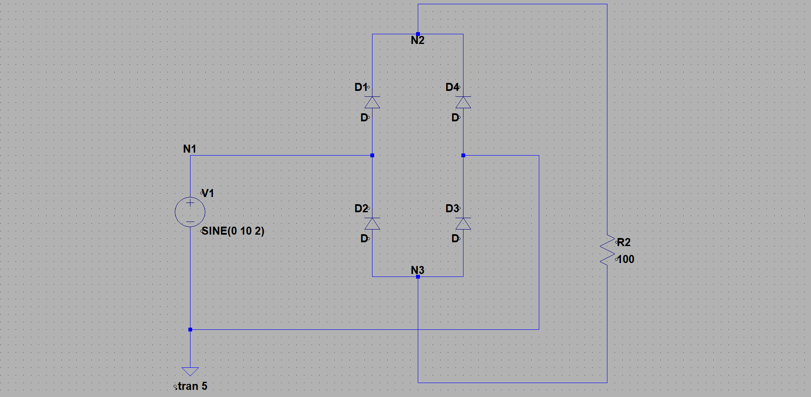
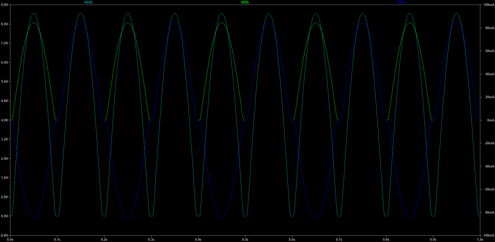

Iがpi/2進んでいる

# AM変調
3I14 公文健太

## 目的
電子回路の動作をシミュレーションする

## 課題1
> 下のような静電容量Cと電圧源からなる回路を作成し，Cの電圧波形と電流波形を描画すること．
その際に，Cにかかる電圧と流れる電流の位相差はどうなっているか考察せよ．

- 結果  
    
    

- 考察  
    IがVに対してpi/2進んでいる

## 課題2
> 下の図のようなRL直列回路を作成し，R,Lそれぞれにかかる電圧波形と電流波形を描画せよ．
その結果から，電流・電圧の位相特性について考察せよ．ノード名は適宜つけよ．

- 結果  
    - 2hz  
    
    
    - 60hz
    
    

- 考察  

## 課題3
> 下の図のように２つの電圧源を配置し，「リサージュ図形」を観測せよ．問：リサージュ図形とは何か？
電圧波形を描画し，横軸を「V(w2)」と変更すればよい．
また，周波数を変えてみると描画波形は変化するか，いろいろと変えてみよ．

- 結果  
    
    

- 考察  
x軸の幅 = w2.amplitude * 2
x軸の初期値 = w2.dc_offset
y軸の幅 = w1.amplitude
y軸の初期値 = w1.dc_offset
グラフの形はheltzの比で決まる
比が有理数なら閉曲線になる(拡大して見ると折り返している)、この時の比は必ず 小さいほう / 大きい方 となる
https://zenn.dev/k_kuroguro/articles/b73e4e6e3d2c13

## 課題4
> 好きな回路を自作し、どのような動作をするか考察せよ

- 結果  
    
    

- 考察  

## 感想
