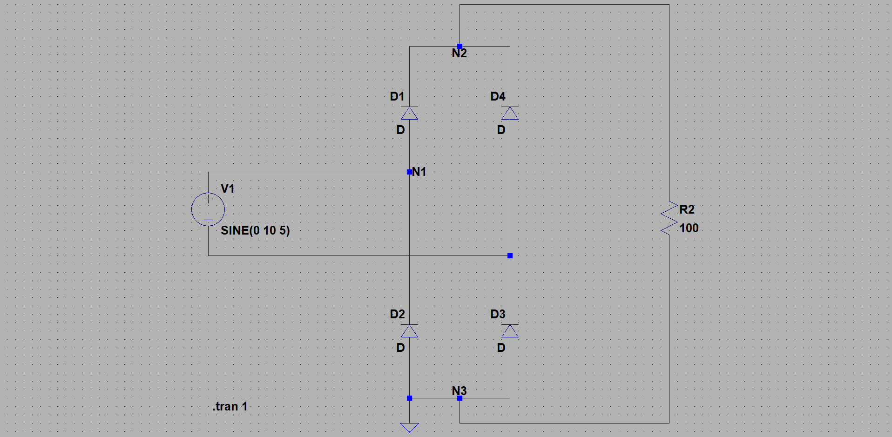

# AM変調
3I14 公文健太

## 目的
電子回路の動作をシミュレーションする

## 課題1
> 下のような静電容量Cと電圧源からなる回路を作成し，Cの電圧波形と電流波形を描画すること．
その際に，Cにかかる電圧と流れる電流の位相差はどうなっているか考察せよ．

- 結果  
    
    

- 考察  
    波形より、 $I$ が $V$ に対して $\frac{\pi}{2}$ 進んでいる
    これは、 $I = V\cdot jX_c \Leftrightarrow \theta_I = \theta_V + \frac{\pi}{2}$ であることからも正しいことがわかる

## 課題2
> 下の図のようなRL直列回路を作成し，R,Lそれぞれにかかる電圧波形と電流波形を描画せよ．
その結果から，電流・電圧の位相特性について考察せよ．ノード名は適宜つけよ．

- 結果  
    
    - 2hz  
        - 電流  
              
        - 電圧  
              
    - 60hz  
        - 電流  
              
        - 電圧  
              

- 考察  
    波形より、 $I_R$ と $I_C$ の位相は同じで、 $V_{ns}$ は $V_{nl}$ に対して遅れている
    このときの位相角 $\theta$ は $\theta_{ns} = \arctan \frac{\omega L}{R}, \theta_{nl} = \frac{\pi}{2}$ より、 $\theta = \theta_{ns} - \theta_{nl} = \arctan \frac{\omega L}{R} - \frac{\pi}{2}$ である
    また、周波数を増加させると波形の周期が短くなり、振幅が大きくなり、位相差が小さくなった
    これは、先程の式からわかる

## 課題3
> 下の図のように２つの電圧源を配置し，「リサージュ図形」を観測せよ．問：リサージュ図形とは何か？
電圧波形を描画し，横軸を「V(w2)」と変更すればよい．
また，周波数を変えてみると描画波形は変化するか，いろいろと変えてみよ．

- 結果  
    振幅A, 周波数F, 位相Pとすると、
    - 初期条件: $A = (1,1), F = (4,2), P = (0,0)$  
          
          
    - $A = (6,10)$  
          
    - $F = (4,2)$  
          
    - $P = (4,8)$  
          
    - $A = (6,10), F = (4,2), P = (4,8)$  
          

- 考察  
    リサージュ図形とは互いに直交する二つの単振動を合成して得られる平面図形のこと
    その性質は、軸に設定する波形を `V(w2)` とした場合、以下のパラメータによって決まる  
    $$
    \begin{align*}
        x軸の幅 &= 2A_{w2} \cr
        x軸の中心値 &= P_{w2} \cr
        y軸の幅 &= 2A_{w1} \cr
        y軸の中心値 &= P_{w1} \cr
        グラフの形 &= 
            \begin{cases}
                \frac{F_{w1}}{F_{w2}} & (F_{w1} \leq F_{w2}) \cr
                \frac{F_{w2}}{F_{w1}} & (F_{w1} \geq F_{w2})
            \end{cases}
    \end{align*}
    $$
    たとえば、$A = (2,4)$ の図形は $A = (4,2)$ の図形を $y = x$ で反転させた図形となり、必ず比の値は $1$ 以下となる
    比の値によってリサージュ図形の形はきまり、比が有理数なら必ず閉曲線となる
    出典: [リサジュー曲線についての数学的説明](https://zenn.dev/k_kuroguro/articles/b73e4e6e3d2c13)

## 課題4
> 好きな回路を自作し、どのような動作をするか考察せよ

- 結果  
    
    
    - 電流
        
    - 電圧
        
- 考察  
波形より、電圧源から出力される電流は正と負の両方を持っているが、負荷にかかる電流は必ず正になることがわかる
これは `V1` で出力された電流が、正の場合は `D1 -> R2 -> D3` と進み、負の場合は `D4 -> R2 -> D2` (正の場合と反対)と進み、結果的に負荷にかかる電流は必ず正のみとなるからである。また、 `GND` を電源のマイナス部ではなく `N3` に置くことで、正と負のいずれの場合でも負荷に上から下への電流が流れるようになっている。ただし、ダイオードの逆バイアス特性より反対側の場合も約 $0.6[V]$ 流れている。

## 感想
電気回路などで習った回路が実際にシュミレートできて面白かった。周波数特性や位相のずれなどが実際に波形を見て理解できた。数学のグラフのように視覚的に見ると理解しやすく間違えにくいため、回路についての理解を助けてくれた。しかし、GNDをいつも暗黙的に考えていたので、明示的に示すのが難しかった。自由課題では全整波回路を実装したが、このGNDの仕様でとても手こずった。実際にどのように電流が流れているのかをイメージできるようになりたい。