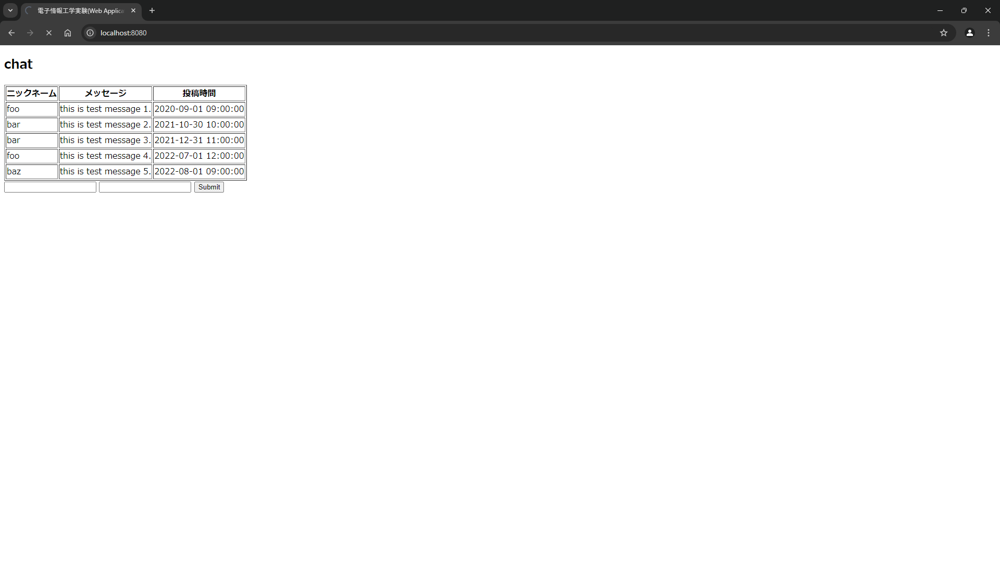

# Webアプリケーション
3I14 公文健太

## 目的

## 環境構築1
- システムの概略  
nginxを用いてwebサーバーを開く  
`src/static/index.html`がコンテンツのソース  
`src/docker/nginx_default.conf`が設定ファイルとして用いられる
- 動作確認の方法  
`docker compose up`コマンドを実行し、`http://localhost:8090/`が動作することを確認する
- 結果  

## 環境構築2
- システムの概略  
nginxを用いてwebサーバーを開く  
pythonのWeb Application Frameworkの一つである`Flask`を用いて、htmlファイルを改変する
`Dockerfile`を用いてpythonライブラリをインストールする  
`main.py`を用いてサーバーアクセス時の挙動を決定する
- 動作確認の方法  
`docker compose up`コマンドを実行し、`http://localhost:8080/`が動作することを確認する
- 結果  

### 課題1
1.  - 動作確認の方法  
    `http://localhost:8080/list`が動作することを確認する
    - 結果  
    
2.  - 動作確認の方法  
    `http://localhost:8080/detail?id=1048576`にアクセスしidの部分が表示されるか確認する
    - 結果  
    
3.  - 動作確認の方法  
    `http://localhost:8080/post1`にアクセスしテキストフィールドに入力しsubmitボタンを押し、`http://localhost:8080/post2`が動作することを確認する
    - 結果  
    
    

### 課題2
1.  - 動作確認の方法 
    `http://localhost:8080/template_sample`が動作することを確認する
    - 結果
    

## 環境構築3
- システムの概略  
mysqlデータベースを用いてデータを格納する  
- 動作確認の方法  
`docker compose up`を実行している最中に`docker compose exec mysql sh -c 'mysql -u appuser -p$MYSQL_PASSWORD'`を実行しデータベースにアクセスする
- 結果

## 環境構築4
- システムの概略  
データベースにアクセスするのにpythonライブラリの`SQLAlchemy`を利用する  
`settingdb.py`がデータベースに接続するためのクラス
`chat.py`がChatテーブルのひな型となる
- 動作確認の方法  
`docker compose up`を実行している最中に`docker compose exec flask python3 chat.py`を実行しデータベースにアクセスする
- 結果

### 課題3
1.  - 動作確認の方法  
    `docker compose up`を実行している最中に`docker compose exec flask python3 chat.py`を実行しデータベースにアクセスする
    - 結果  
    

### 課題4
1.  - 動作確認の方法  
    `http://localhost:8080/`にアクセスし、過去データの表示、データを入力した時に自動的に`http://localhost:8080/`が読み込まれ、入力したものが表示されていることを確認する。
    - 結果  
    

## 感想
サーバーを立てる方法、また通信する際に渡すhtmlファイルを動的に変更する方法を学んだ。webサイトを入力に応じて変更することができて楽しかった。pythonはライブラリが充実していてたくさんのことができて楽しかった。