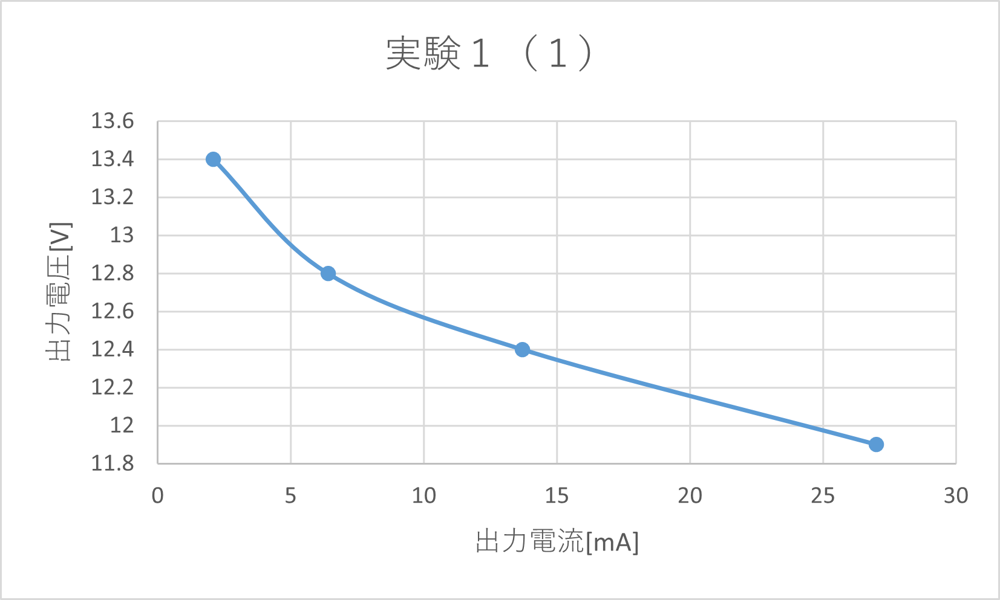
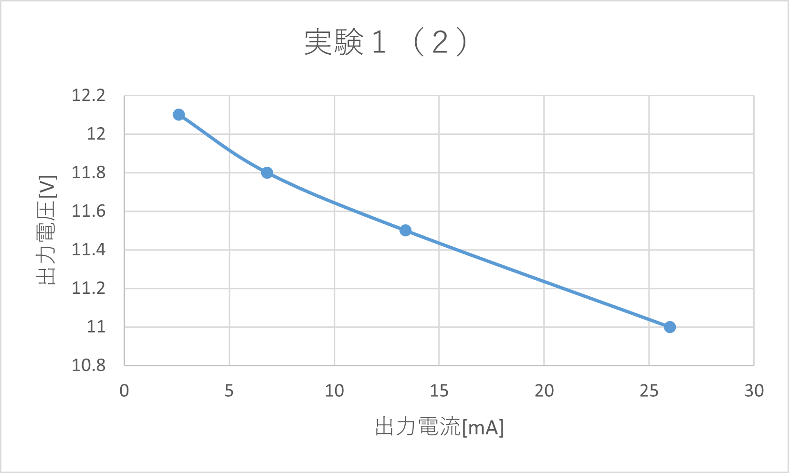
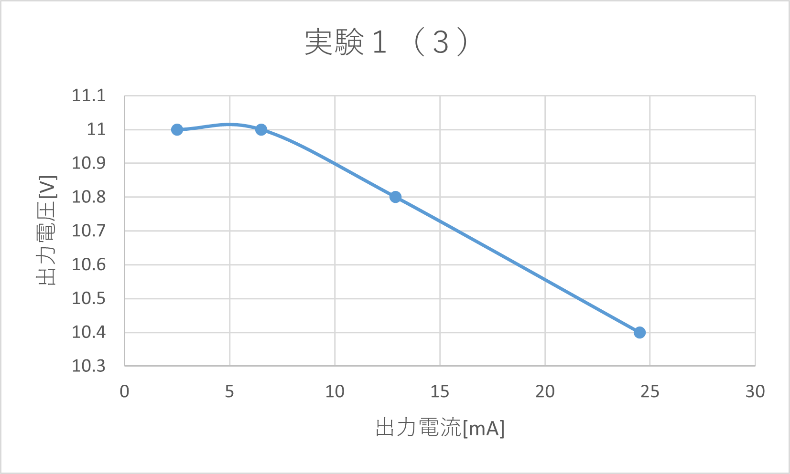
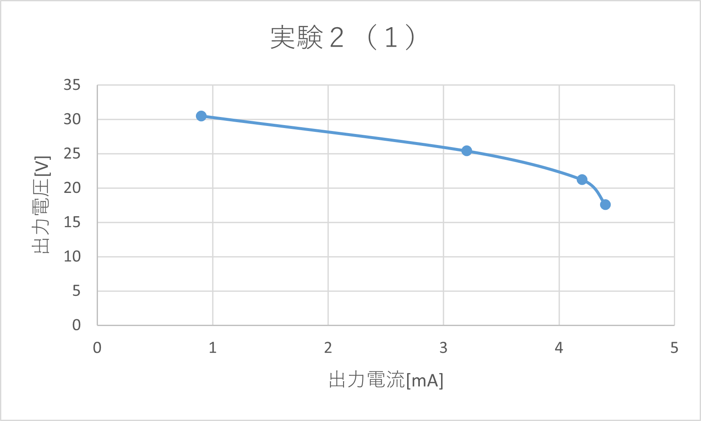
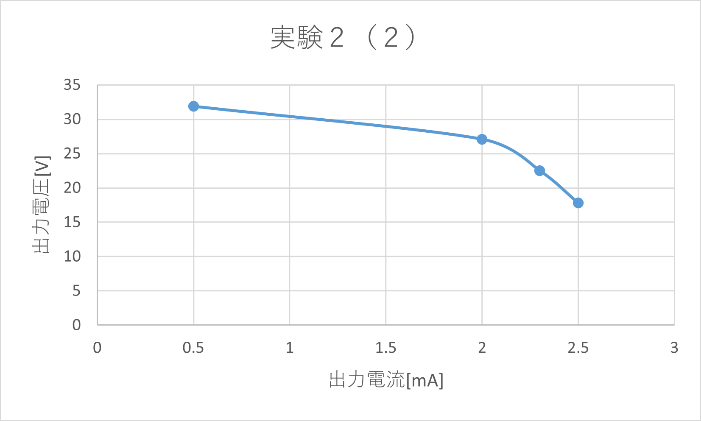

# 整流と平滑化
3I14 公文健太

## 目的
交流から直流に変換する基本原理を理解する  
オシロスコープを用いてリップルを観測する

## 実験1
### 半波整流 + コンデンサ
波形
- AC  
  
- DC  
  

### 半波整流 + π型1段
- AC  
  
- DC  
  

### 半波整流 + π型2段
- AC  
  
- DC  
  

## 実験2
### 全波整流 + L型1段
- AC  
  
- DC  
  

### 全波整流 + L型2段
- AC  
  
- DC  
  

## 検討
1. リップル率
    |     | 510    | 1k     | 2k     | 5.1k   | 
    | --- | ------ | ------ | ------ | ------ | 
    | 1-1 | 1.0504 | 1.0081 | 0.9766 | 0.9328 | 
    | 1-2 | 1.0909 | 1.0870 | 1.0593 | 1.0331 | 
    | 1-3 | 1.1538 | 1.1111 | 1.0909 | 1.0909 | 
    | 2-1 | 0.3977 | 0.3726 | 0.2362 | 0.1279 | 
    | 2-2 | 0.3371 | 0.2222 | 0.1476 | 0.0627 | 
2. 平滑回路の段数を増やすことによって、出力電圧はどのように変化したか
    リップル電圧が減少することによってより安定し、その分出力電圧が増加する
3. 負荷抵抗を変えたことによる、出力電流とDC出力電圧の関係のグラフ
    - 1-1
    
    - 1-2
    
    - 1-3
    
    - 2-1
    
    - 2-2
    
    どちらの場合でも、出力電流が増加すると出力電圧は減少する

## 研究
- 図  
  

図の上方向からくる電流が正の場合と負の場合で分けられる 
- 正のときのはたらき  
D1が正の電流を通し、D3が負の電流を通す。
- 負のときのはたらき  
D4が正の電流を通し、D2が負の電流を通す。

結果として、正の部分は通常通り取り出され、負の部分は回路に逆方向に流されることにより結局正方向として流される。よって正の電力のみになる。

## 感想
交流で送られてきた電流をダイオードを用いて整流し、コンデンサやコイルを用いて平滑化することができた。あまりきれいに平滑化はできなかったが、平滑化の原理を少し理解することができてよかった。