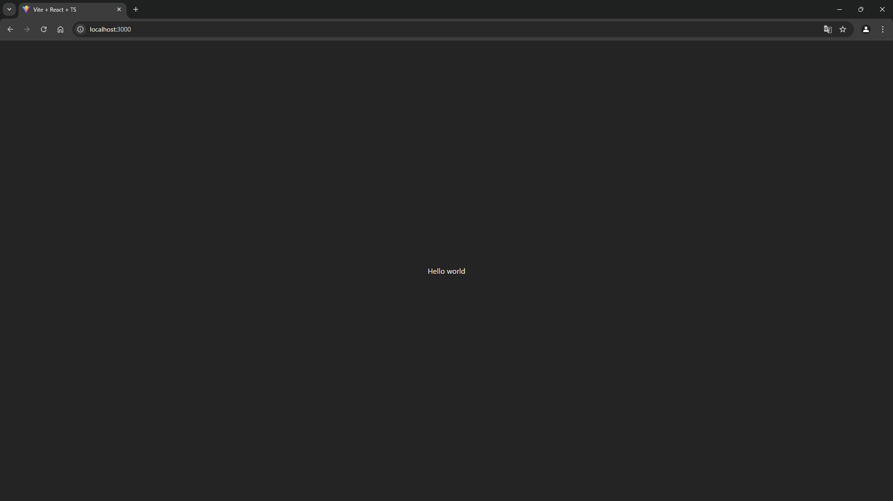
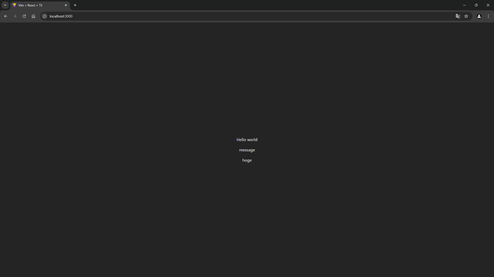
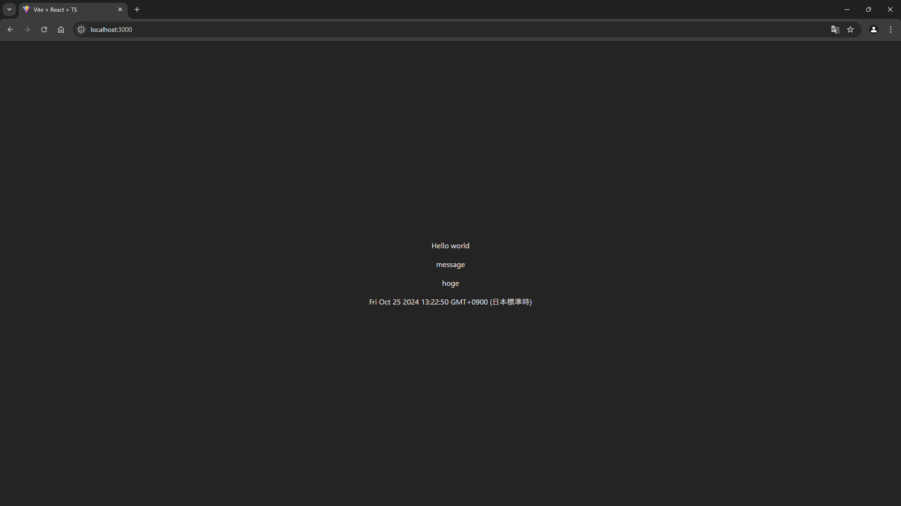
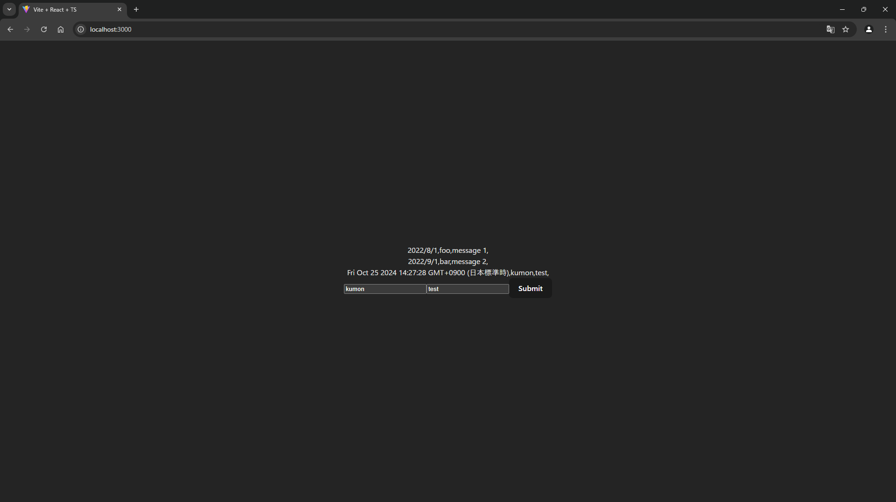
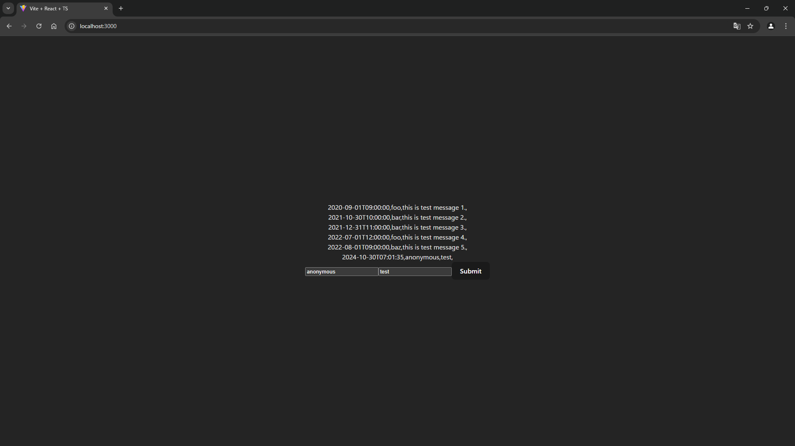
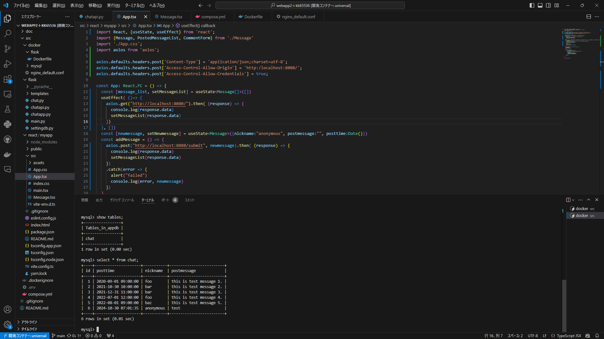

# Webアプリケーション2
3I14 公文健太

## 目的
- Javascript/Typescriptを使ってみる
- フロントエンドフレームワークReactを使ってみる
- Webアプリケーション開発における、フロントエンド開発、バックエンド開発、デザイン開発の関係性を理解する
- Git/GitHubを使った開発を行う

## 環境構築1
- システムの概略  
reactを用いてwebサーバーを開く  
- 動作確認の方法  
`docker compose up`コマンドを実行し、`http://localhost:3000/`が動作することを確認する
- 結果  

## 課題1
1.  1.  - 動作確認の方法  
            `http://localhost:3000/`に接続し、`Sample2`に与えたプロパティが表示されるか確認する
    1.  - 動作確認の方法  
            `http://localhost:3000/`に接続し、`Sample3`に与えたプロパティが表示されるか確認する
    - 結果  
    
2.  - 動作確認の方法  
    `http://localhost:3000/`に接続し、時刻が表示されるか確認する
    - 結果  
     

## 課題2
- システムの概略  
名前とメッセージを投稿することができ、投稿は時間とともに表示される  
- 動作確認の方法  
ブラウザ上で左のフォームと右のフォームに入力し、Submitボタンを押すと、上で表示されるメッセージが増えることを確認する
- 結果  

## 選択課題1
- システムの概略  
フロントエンド: React(`http://localhost:3000/`), バックエンド: なし の環境から、  
フロントエンド: React(`http://localhost:3000/`), バックエンド: Flask(`http://localhost:8080/`) に移行した  
Reactから、ポストデータをREST APIを用いてバックエンドから取得し、バックエンドでは、sqlalchemyライブラリを用いて、mysqlデータベースからデータを取得した  
また、入力データのデータベースへの格納は、フロントエンドで取得した入力データを`axios.post()`を用いてバックエンド側(`http://localhost:8080/submit`)に渡しアクセスし、バックエンドではその値をデータベースに格納するようにした
- 動作確認の方法  
ブラウザ上で左のフォームと右のフォームに入力し、Submitボタンを押すと、上で表示されるメッセージが増えることを確認する  
また、入力したデータがデータベースに格納されていることを確認する
- 結果  
  

## 感想
Reactを用いて動的にhtmlを返すことができた。前回の実験では、どのアドレスにアクセスすればどこにつながるのかあまりわかっていなかったが、今回で大まかなつながりの流れは理解できた。選択課題1では、compose.ymlファイルがどのようなことをしているのかわかっていなかったため最初は動作がわからなかったが、react、nginx、flaskなどがそれぞれどのような働きをしていたのかを理解することでcompose.ymlに書いてあることが少し理解することができた。しかし、フロントエンドのReactとバックエンドのFlaskのつながりをつくる仕組みはよくわかっていないので次はそこについても理解したい。