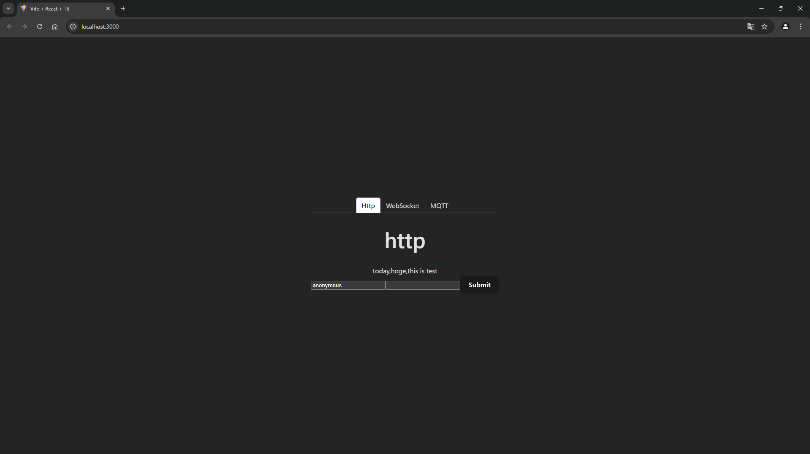
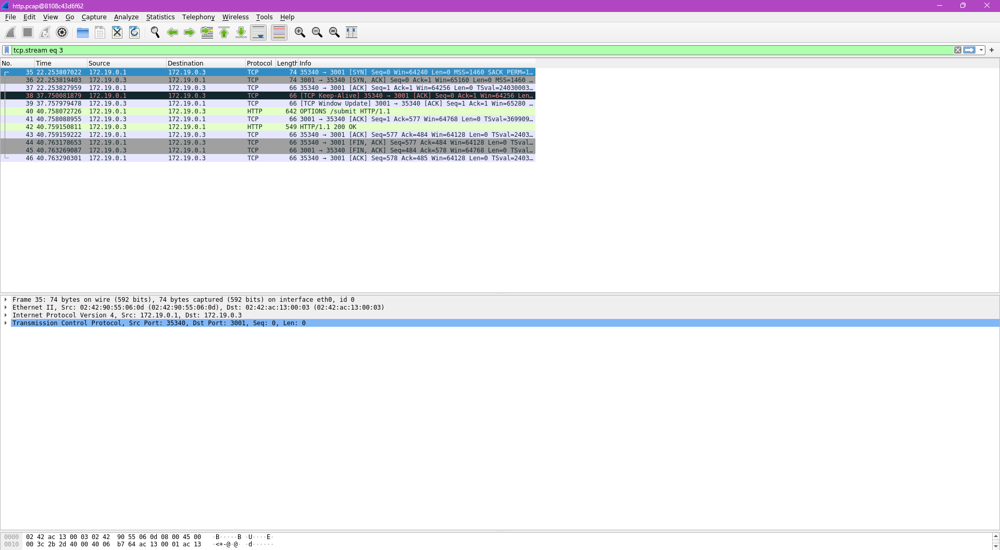
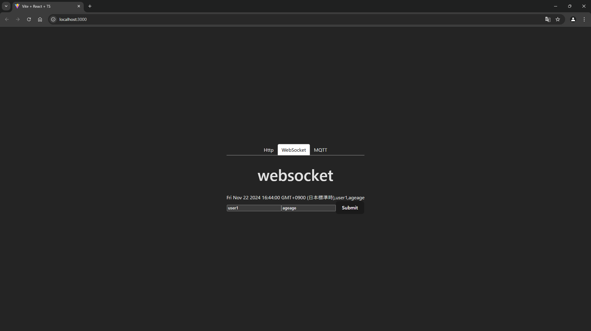
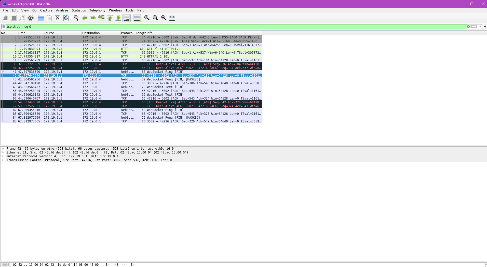
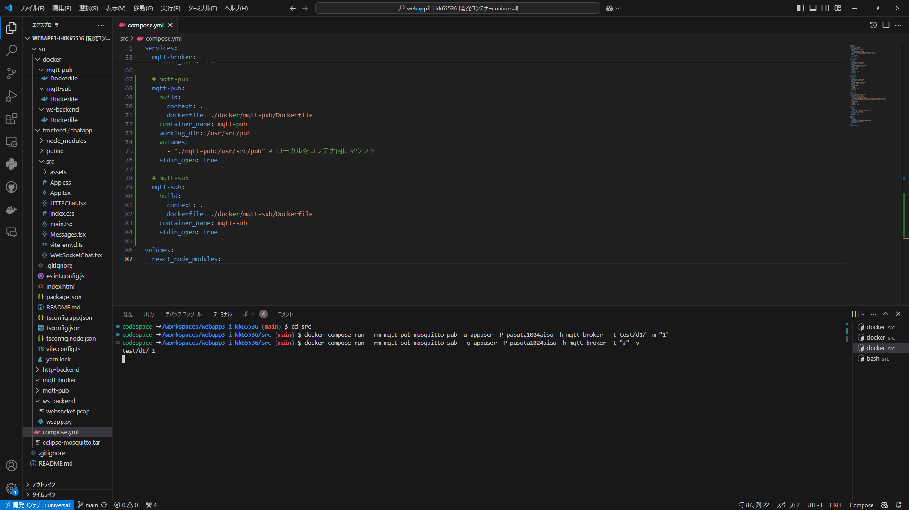
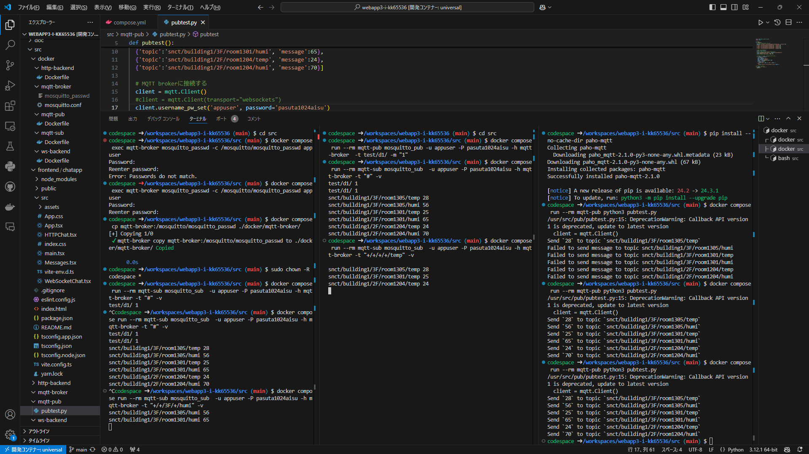
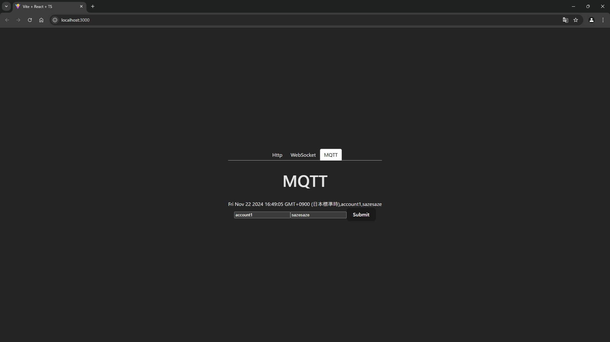
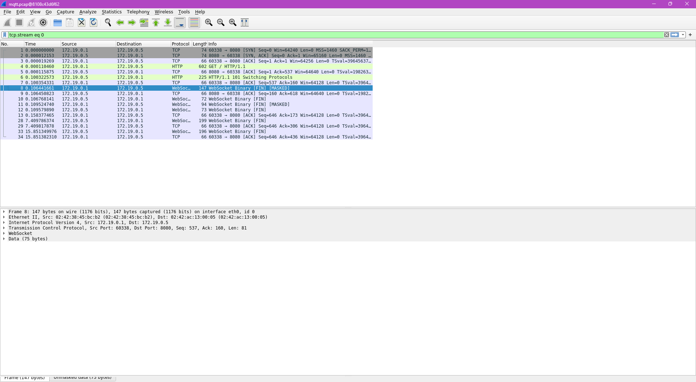

# Webアプリケーション3
3I14 公文健太

## 目的
- WebSocketについて理解する
- MQTTについて理解する
- ネットワークプロトコルの違いにより、アーキテクチャ、実装方法、通信量などが異なることを理解する
- Webアプリケーション開発における、ネットワークプロトコルの選定について学ぶ

## 環境構築1
- システムの概略  
フロントエンドはReactを用い`http://localhost:3000`ポートを使用、Httpタブのバックエンドは`http://localhost:3001`ポートを使用している  
サーバーとクライアントの一対一の通信であるため、ほかのブラウザで開いたとしてもデータは共有されない
- 動作確認の方法  
`docker compose up`コマンドを実行し、ブラウザで`http://localhost:3000`にアクセスし、Httpタブを開く
- 結果
  

## 課題1
- 動作確認の方法  
1. `docker compose exec http-backend tshark -i eth0 -w http.pcap`コマンドを実行
2. フォームに入力し、表示されることを確認する。(2回違う文字列で行う)
3. tsharkを止める(Ctrl-C)
4. `sudo chmod 755 http-backend/http.pcap`
   `wireshark http-backend/http.pcap` コマンドを実行しwiresharkで解析を行う
- 結果
    1,405 [bytes]
    - 35, 36, 37行目
    TCPハンドシェイク(TCP接続の確立)
    - 40行目
    HTTP POST REQUEST
    - 42行目
    HTTP RESPONSE

  

## 環境構築2
- システムの概略  
フロントエンドは同様、WebSocketタブのバックエンドはpythonライブラリ`flask_sock`を用い`http://localhost:3002`ポートを使用している  
WebSocketを用いることで、サーバ、クライアント間のメッセージをやり取りし、複数ユーザへの同時データ送信を実現している
- 動作確認の方法  
フォームに入力したデータが表示されること  
複数のブラウザで接続したときに、同時に表示されることを確認する
- 結果  

## 課題2
- 動作確認の方法  
1. `docker compose exec ws-backend tshark -i eth0 -w websocket.pcap`コマンドを実行
2. ブラウザで http://localhost:3000/ にアクセスし、Fromへ入力し、表示させる。(2回違う文字列で行う)
3. パケットキャプチャを終了する（端末でCtrl+C）
4. `sudo chmod 755 ws-backend/websocket.pcap`
   `wireshark ws-backend/websocket.pcap` コマンドを実行しwiresharkで解析を行う
- 結果
    2,407 [bytes]
    - 5, 6, 7行目
    TCPハンドシェイク(TCP接続の確立)
    - 8行目
    HTTP GET
    - 10行目
    HTTP RESPONSE

 

## 環境構築3
- システムの概略  
MQTT Brokerを作成し、`0.0.0.0:1883`ポートを使用
MQTTクライアントとしてpublisherとして`mqtt-pub`, subscriberとして`mqtt-sub`コンテナを用意する
- 動作確認の方法  
`docker compose run --rm mqtt-sub mosquitto_sub  -u appuser -P UYII8ceNiICh -h mqtt-broker -t "#" -v`コマンドでsubscriberを起動する
`docker compose run --rm mqtt-pub mosquitto_pub -u appuser -P UYII8ceNiICh -h mqtt-broker  -t test/d1/ -m "1"`コマンドで
publishし、`test/d1/`, メッセージとして`1`を送る
- 結果  
 

## 課題3
- 動作確認の方法  
1. `docker compose run --rm mqtt-pub python3 pubtest.py`コマンドでpublishする
2. `docker compose run --rm mqtt-sub mosquitto_sub  -u appuser -P pasuta1024aisu -h mqtt-broker -t "+/+/+/+/temp" -v`コマンドで全デバイスの温度を取得する
3. `docker compose run --rm mqtt-sub mosquitto_sub  -u appuser -P pasuta1024aisu -h mqtt-broker -t "+/+/3F/+/humi" -v`コマンドで全ての3Fの部屋の湿度を取得する
- 結果
 

## 環境構築4
- システムの概略  
フロントエンドは同様、MQTTタブのバックエンドは`MQTT over WebSocket`を用い`http://localhost:8080`ポートを使用している  
- 動作確認の方法  
`docker compose up`コマンドでサーバーを立ち上げ、フォームに入力したデータが表示されることを確認する
- 結果  
 

## 課題4
- 動作確認の方法  
1. `docker compose exec mqtt-broker tshark -i eth0 -w mqtt.pcap`コマンドでMQTT brokerでパケットキャプチャする
2. ブラウザで`http://localhost:3000/`にアクセスし、MQTTタブのFromへ入力し、表示させる。(2回違う文字列で行う)
3. パケットキャプチャを終了する（端末でCtrl+C）
4. `sudo chmod 755 mqtt-broker/mqtt.pcap`
   `wireshark mqtt-broker/mqtt.pcap` コマンドを実行しwiresharkで解析を行う
- 結果
2,218 [bytes]
 

## 感想
通信の種類を学べた。用途に応じて適切につかうものを変えることがクライアントのニーズである通信速度であったりサーバーのニーズである負荷の低さだったりをうまく抑えることに繋がることがわかった。しかし、通信についてはクライアントとサーバーの関係をパケットを解析して理解することはまだまだできていないのでより低い層の部分からしっかり学んで理解できるようにしたい。