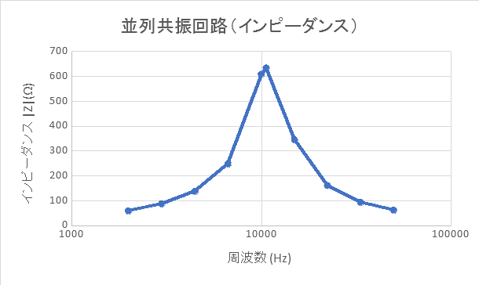
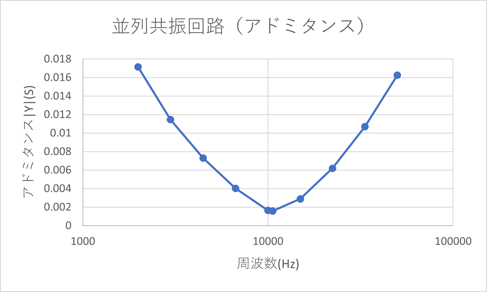

# 共振回路の特性

3I14 公文健太

共同実験者：3I08 井上高志

## 目的

自己インダクタンスＬや容量Ｃを含む直列、並列回路の共振曲線を測定して､その共振特性につ
いて理解を深める。

## 素子

11 番

インダクタンス L
4.78 [mH]

内部抵抗 r
3.83 [Ω]

外付け抵抗 R
178.9 [Ω]

コンデンサ C
47.1 [nF]

## 実験

### 直列共振

| f(Hz)             | VR(mV) | VL(mV) | VC(mV) | I(mA) | XL(Ω)   | XC(Ω)    | Z=XL-XC(Ω) | インピーダンス ABS(Z)[Ω] | アドミタンス ABS(Y)[S] |
| ----------------- | ------ | ------ | ------ | ----- | ------- | -------- | ---------- | ------------------------ | ---------------------- |
| 1989              | 170    | 160    | 1000   | 0.950 | 168.376 | 1052.353 | -883.976   | 883.976                  | 0.00113                |
| 2978              | 180    | 220    | 1050   | 1.006 | 218.656 | 1043.583 | -824.928   | 824.928                  | 0.00121                |
| 4462              | 210    | 350    | 1100   | 1.174 | 298.167 | 937.095  | -638.929   | 638.929                  | 0.00157                |
| 6684              | 410    | 680    | 1300   | 2.292 | 296.712 | 567.244  | -270.532   | 270.532                  | 0.00370                |
| 10000             | 790    | 1580   | 1600   | 4.416 | 357.800 | 362.329  | -4.529     | 4.529                    | 0.22079                |
| 14960             | 720    | 1700   | 900    | 4.025 | 422.403 | 223.625  | 198.778    | 198.778                  | 0.00503                |
| 22320             | 480    | 1300   | 350    | 2.683 | 484.521 | 130.448  | 354.073    | 354.073                  | 0.00282                |
| 33400             | 350    | 1050   | 120    | 1.956 | 536.700 | 61.337   | 475.363    | 475.363                  | 0.00210                |
| 50000             | 300    | 1000   | 50     | 1.677 | 596.333 | 29.817   | 566.517    | 566.517                  | 0.00177                |
| 理論値=約 10670Hz | 830    | 1750   | 1600   | 4.639 | 377.199 | 344.867  | 32.331     | 32.331                   | 0.03093                |

$f_0=10000[Hz]$

### 並列共振

| f(Hz)        | VR(mV) | VLC(mV) | I(mA) | ABS(Y)[S] | ABS(Z)[Ω] |
| ------------ | ------ | ------- | ----- | --------- | --------- |
| 1989         | 920    | 300     | 5.143 | 0.01714   | 58.337    |
| 2978         | 840    | 410     | 4.695 | 0.01145   | 87.320    |
| 4462         | 730    | 560     | 4.080 | 0.00729   | 137.238   |
| 6684         | 520    | 720     | 2.907 | 0.00404   | 247.708   |
| 10000        | 250    | 850     | 1.397 | 0.00164   | 608.260   |
| 理論値=10606 | 240    | 850     | 1.342 | 0.00158   | 633.604   |
| 14960        | 420    | 810     | 2.348 | 0.00290   | 345.021   |
| 22320        | 710    | 640     | 3.969 | 0.00620   | 161.262   |
| 33400        | 880    | 460     | 4.919 | 0.01069   | 93.516    |
| 50000        | 960    | 330     | 5.366 | 0.01626   | 61.497    |

$f_0=10606[Hz]$

### 並列共振特性から帯域幅Ｂをそれぞれ求めよ。この値から、Ｑを求めよ。

$$\frac{Z(f_0)}{\sqrt{2}}=447.6...$$
より、$f_1,f_2はおよそ7500,12500[Hz]$
よって、$$B=5000[Hz]$$
$$Q=\frac{f_0}{B}=2.1212$$

## 研究及び検討事項

### Ｑの実験から得た値と、袋に記載済されたインピーダンスメータを⽤いた測定値から求めた値($Q_0$)とを⽐較せよ。

$$Q_0=\frac{\omega_0L}{r+R}=\frac{10606\cdot2\pi*4.78\cdot10^{-3}}{3.83+178.9}=1.74321...$$

実測値$Q$よりもやや$Q_0$のほうが小さい値になった。

### 共振回路の実際の利⽤例について調べよ。

鉱⽯ラジオ 鉱⽯ラジオとは回路の⼀部に鉱物の結晶を⽤いた受信機であり、アンテナから拾った微弱な周波
数の電波エネルギーをそのまま利⽤してイヤホンを鳴らすもの 具体的には、鉱⽯ラジオのアンテナは、さま
ざまな周波数の電波をとらえ、検波回路（鉱⽯やダイオード）によって⼀定⽅向の交流電流を回路に流して
いる。 回路に並列または直列に、コンデンサとコイルを組み合わせた同調回路を挿⼊して、特定の周波数を
取り出すことによって、好みの放送局を聴けるようにしている。
https://www.tdk.com/ja/techmag/hatena/011
