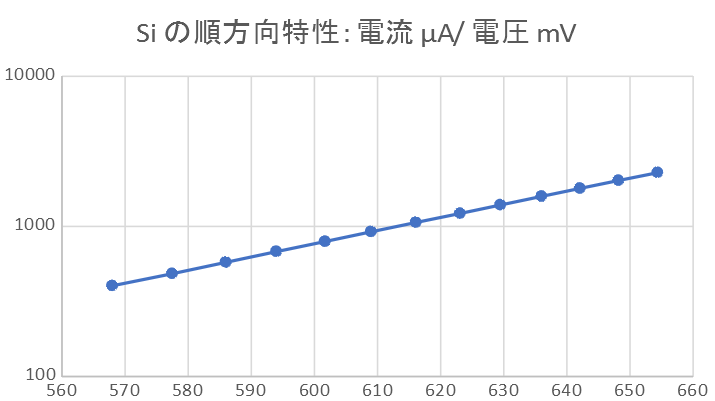
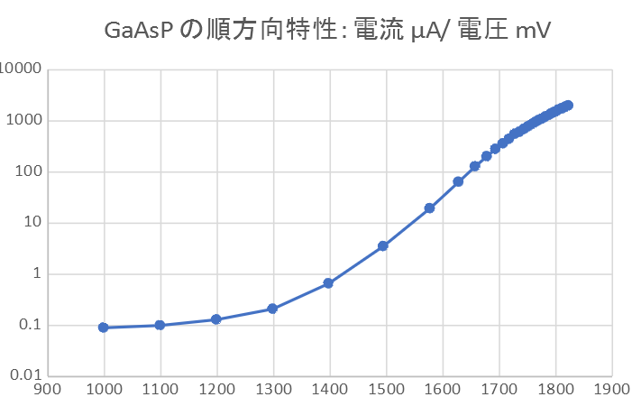
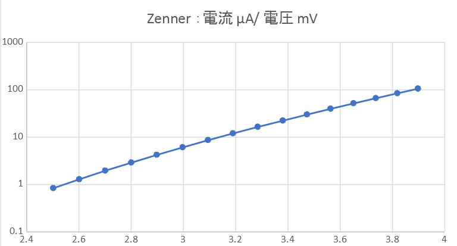
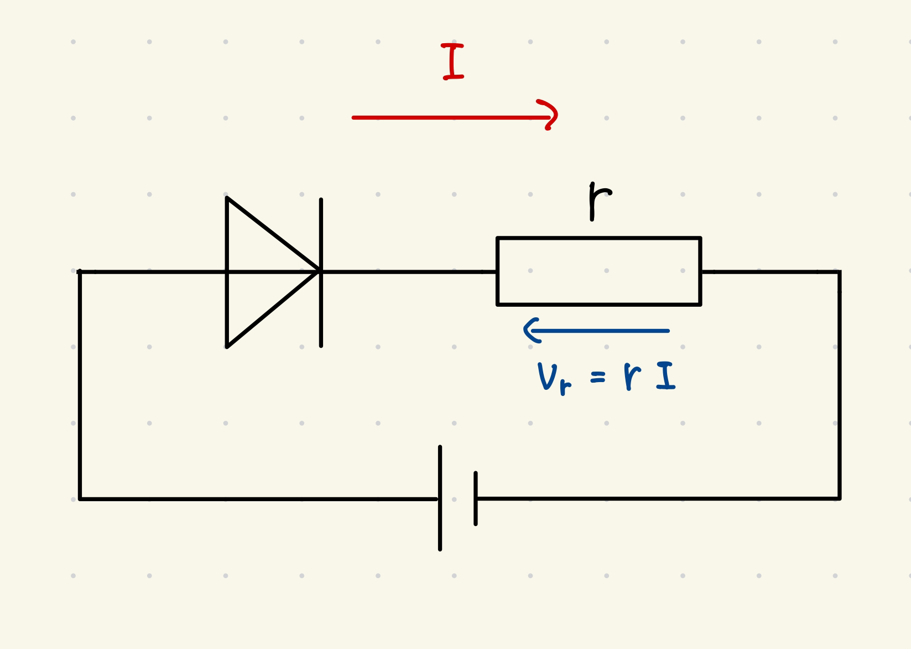
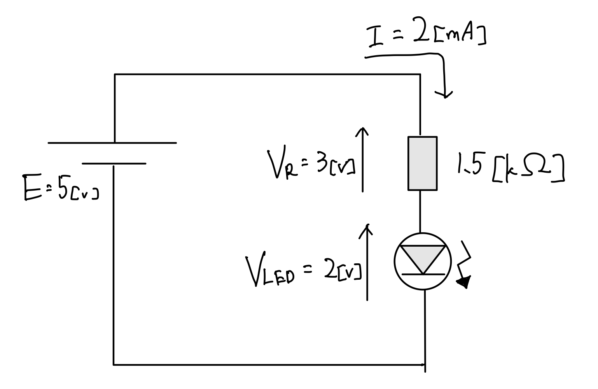

# ダイオードの基礎

3I14 公文健太

## 実験日状態

- **日時**:2024/11/22 5-8 限
- **気温**：21.3℃
- **湿度**：33%
- **天候**：晴れ
- **共同実験者**：21 席 高士陽生
- **デスク番号**：18、19

## 目的

- 電気回路、電子回路を構成する基本素子のひとつであるダイオードの基本的な働きについて理解する。

## 実験 ①：ダイオードの順方向特性

> 3 種類のダイオード（Si, Ge, GaAsP）の順方向特性を求めよ

- $n$値計算 基準点$p$と任意のもう一つの点$q$で求めることにした

$$n = \frac{V_p-V_q[V]}{0.026*ln(\frac{I_q}{I_p})} $$

- $ I_s $ 計算　$q$点の$n$値$n_q$、電圧$V_q$、電流$I_q$

$$ I_s=\frac{I_q}{exp(\frac{V_q[V]}{0.026\*n_q})} $$

### 以下、n 値は一つ下のセルの値と自身で計算している

### Si

| E [V] | V [mV] | A [μA] | V [V] | A [A]    | n          | Is [μA]    |
| ----- | ------ | ------ | ----- | -------- | ---------- | ---------- |
| 1     | 568.0  | 402.0  | 0.568 | 0.000402 | 1.97271    | 399.00     |
| 1.1   | 577.5  | 483.8  | 0.578 | 0.000484 | 1.86490    | 479.92     |
| 1.21  | 586.0  | 576.5  | 0.586 | 0.000577 | 1.87349    | 571.83     |
| 1.331 | 594.0  | 679.4  | 0.594 | 0.000679 | 1.91858    | 673.95     |
| 1.464 | 601.7  | 792.8  | 0.602 | 0.000793 | 1.87726    | 786.22     |
| 1.611 | 609.0  | 920.7  | 0.609 | 0.000921 | 1.91390    | 913.11     |
| 1.772 | 616.1  | 1061.9 | 0.616 | 0.001062 | 1.94442    | 1053.19    |
| 1.949 | 623.1  | 1219.6 | 0.623 | 0.001220 | 1.89260    | 1209.20    |
| 2.144 | 629.5  | 1389.0 | 0.630 | 0.001389 | 1.89665    | 1377.07    |
| 2.358 | 636.0  | 1584.7 | 0.636 | 0.001585 | 1.91712    | 1571.09    |
| 2.594 | 642.1  | 1791.0 | 0.642 | 0.001791 | 1.94109    | 1775.66    |
| 2.853 | 648.2  | 2021.1 | 0.648 | 0.002021 | 1.97838    | 2003.96    |
| 3.138 | 654.4  | 2280.0 | 0.654 | 0.002280 | エラー:502 | エラー:502 |

### Ge

| E [V] | V [mV] | A [μA] | V [V]  | A [A]   | n          | Is [μA]           |
| ----- | ------ | ------ | ------ | ------- | ---------- | ----------------- |
| 1     | 257.8  | 680.4  | 0.2578 | 0.00068 | 3.0547     | 678.908668376133  |
| 1.1   | 266.9  | 763.0  | 0.2669 | 0.00076 | 3.5009     | 761.489104720922  |
| 1.2   | 276.3  | 846.1  | 0.2763 | 0.00085 | 3.5758     | 844.401803441457  |
| 1.3   | 285.1  | 929.5  | 0.2851 | 0.00093 | 3.6033     | 927.590150390595  |
| 1.4   | 293.1  | 1012.9 | 0.2931 | 0.00101 | 4.1287     | 1011.03216805309  |
| 1.5   | 301.8  | 1098.0 | 0.3018 | 0.00110 | 3.9042     | 1095.79568983036  |
| 1.6   | 309.2  | 1181.5 | 0.3092 | 0.00118 | 4.3089     | 1179.29770710345  |
| 1.7   | 316.9  | 1265.9 | 0.3169 | 0.00127 | 4.2472     | 1263.44636781452  |
| 1.8   | 324.2  | 1351.8 | 0.3242 | 0.00135 | 4.4855     | 1349.26224313462  |
| 1.9   | 331.3  | 1436.9 | 0.3313 | 0.00144 | 4.6941     | 1434.26565459868  |
| 2     | 338.3  | 1521.1 | 0.3383 | 0.00152 | 4.6838     | 1518.24661598191  |
| 2.1   | 344.9  | 1607.0 | 0.3449 | 0.00161 | 4.8137     | 1604.0087810382   |
| 2.2   | 351.5  | 1692.8 | 0.3515 | 0.00169 | 4.9171     | 1689.6570993788   |
| 2.3   | 357.9  | 1779.7 | 0.3579 | 0.00178 | 5.1600     | 0.001776493892056 |
| 2.4   | 364.2  | 1866.1 | 0.3642 | 0.00187 | 5.2440     | 0.001862733310794 |
| 2.5   | 370.4  | 1952.2 | 0.3704 | 0.00195 | 5.3605     | 0.001948696309871 |
| 2.6   | 376.3  | 2037.2 | 0.3763 | 0.00204 | エラー:502 | エラー:502        |

### LED

| E [V] | V [mV] | A [μA] | V [V]  | A [A]      | n                | Is [μA]           |
| ----- | ------ | ------ | ------ | ---------- | ---------------- | ----------------- |
| 1     | 998.7  | 0.09   | 0.999  | 9E-08      | 36.5412030869651 | 0.089936068665577 |
| 1.1   | 1098.8 | 0.10   | 1.099  | 1E-07      | 14.6302757589807 | 0.099804918750576 |
| 1.2   | 1198.6 | 0.13   | 1.199  | 1.3E-07    | 8.00391368165502 | 0.129494823221583 |
| 1.3   | 1298.4 | 0.21   | 1.298  | 2.1E-07    | 3.32175255169436 | 0.207876614188204 |
| 1.4   | 1397.3 | 0.66   | 1.397  | 6.6E-07    | 2.22262254467491 | 0.649299681883073 |
| 1.5   | 1494.2 | 3.53   | 1.494  | 3.53E-06   | 1.86216145173749 | 3.45711853202598  |
| 1.6   | 1576.7 | 19.40  | 1.577  | 1.94E-05   | 1.64014399957572 | 18.9211207337211  |
| 1.7   | 1627.6 | 64.00  | 1.628  | 6.4E-05    | 1.62412497816896 | 62.3539768677337  |
| 1.8   | 1657.1 | 128.70 | 1.657  | 0.0001287  | 1.74860821113614 | 125.56766131677   |
| 1.9   | 1677.7 | 202.47 | 1.678  | 0.00020247 | 1.79285763949158 | 197.60335069552   |
| 2     | 1693.0 | 281.13 | 1.693  | 0.00028113 | 2.07139632299405 | 275.218904123069  |
| 2.1   | 1706.3 | 359.88 | 1.706  | 0.00035988 | 2.07368028800216 | 352.262589866268  |
| 2.2   | 1717.3 | 441.33 | 1.717  | 0.00044133 | 1.67235759753588 | 429.702959988502  |
| 2.3   | 1727.1 | 552.9  | 1.727  | 0.0005529  | 3.61291271087195 | 546.070579671447  |
| 2.4   | 1735.9 | 607.2  | 1.736  | 0.0006072  | 2.33979245817355 | 595.59966446852   |
| 2.5   | 1743.8 | 691.4  | 1.744  | 0.0006914  | 2.42770303304176 | 678.607518638643  |
| 2.6   | 1751.2 | 777.4  | 1.751  | 0.0007774  | 2.5490095734892  | 763.637124271355  |
| 2.7   | 1758.0 | 861.4  | 1.758  | 0.0008614  | 2.44125572723865 | 845.421924319653  |
| 2.8   | 1764.0 | 946.8  | 1.764  | 0.0009468  | 2.66322030916871 | 930.634508918127  |
| 2.9   | 1770.0 | 1032.5 | 1.770  | 0.0010325  | 3.21375213239118 | 1017.82025465416  |
| 3     | 1776.7 | 1118.7 | 1.777  | 0.0011187  | 2.7128196284265  | 1099.81192022209  |
| 3.1   | 1782.0 | 1206.0 | 1.782  | 0.001206   | 2.79497069583242 | 1186.17302599512  |
| 3.2   | 1787.0 | 1291.9 | 1.787  | 0.0012919  | 2.95405551038821 | 1271.73968627373  |
| 3.3   | 1792.0 | 1378.8 | 1.792  | 0.0013788  | 2.94122788167586 | 1357.13051127923  |
| 3.4   | 1796.7 | 1466.2 | 1.797  | 0.0014662  | 3.05223114755231 | 1443.93075336009  |
| 3.5   | 1801.3 | 1553.7 | 1.8013 | 0.0015537  | 1.98936985797404 | 1517.54994419929  |
| 3.6   | 1804.2 | 1643.3 | 1.8042 | 0.0016433  | 4.32416923274594 | 1625.56959381883  |
| 3.7   | 1810.0 | 1730.3 | 1.81   | 0.0017303  | 3.20010938275408 | 1705.04082810932  |
| 3.8   | 1814.1 | 1817.7 | 1.8141 | 0.0018177  | 3.51377441402476 | 1793.46342089045  |
| 3.9   | 1818.4 | 1905.3 | 1.8184 | 0.0019053  | 3.31474048661169 | 1878.31744327891  |
| 4     | 1822.3 | 1993.5 | 1.8223 | 0.0019935  | エラー:502       | エラー:502        |

## 実験 ②：Zenner ダイオードの逆方向特性

### Si

電流は流れなかった

### Zenner

| E [V] | -V [V] | -A [μA] |
| ----- | ------ | ------- |
| 2.5   | 2.5026 | 0.84    |
| 2.6   | 2.6020 | 1.29    |
| 2.7   | 2.7012 | 1.96    |
| 2.8   | 2.8009 | 2.90    |
| 2.9   | 2.8984 | 4.23    |
| 3     | 2.9976 | 6.09    |
| 3.1   | 3.0947 | 8.65    |
| 3.2   | 3.1902 | 12.01   |
| 3.3   | 3.2850 | 16.47   |
| 3.4   | 3.3809 | 22.34   |
| 3.5   | 3.4733 | 30.02   |
| 3.6   | 3.5636 | 39.67   |
| 3.7   | 3.6517 | 51.69   |
| 3.8   | 3.7367 | 66.42   |
| 3.9   | 3.8190 | 84.26   |
| 4     | 3.8981 | 105.68  |

## 考察

### ダイオードに多くの電流を流すと、内部抵抗ｒの影響が無視できなくなることを、図と文章を用いて説明しなさい。

ダイオードの等価回路は、理想的なダイオード素子と直列に接続された内部抵抗$r$で表すことができる。
ダイオードに電圧が加わると、内部抵抗$r$による電圧降下$V_r = I * r$が発生する。
これは電流に比例するので、電流が小さい場合は無視できるが、電流が大きくなると無視できなくなる

### この時の電流と電圧の関係を表すグラフの概要を説明しなさい。

ダイオード素子にかかる実効的な電圧$V_d = V - I * r$
低電流領域では、内部抵抗による電圧降下$I * r$が小さいため、ダイオードの理想的な指数特性があらわれ、グラフは指数関数的に上昇する。
高電流領域では、$I * r$が無視できなくなり、電圧の上昇が緩やかに。

### ５ V の電源を用いて、発光ダイオード（LED）に約２ mA の電流を流したい。何オームの抵抗を用いればよいか計算しその回路図を描きなさい。但し、抵抗は E12 系列であるとする。

実験結果より、2[mA]の電流を流した時の LED の電圧降下は 1.9 ～ 2[V]程度と考えられる。
抵抗にかかる電圧$V_R =5[V]-2[V]=3[V]$
よって抵抗$$R=\frac{3[V]}{2[mA]}=1.5[kΩ]$$
E12 系列には 1.5[kΩ]の抵抗があるので、それを用いればよい。

> 実験で測定した以外のダイオードについて、その種類と利用例を調べて説明しなさい。

### 1. フォトダイオード

フォトダイオードは、光を電気信号に変換する半導体素子です。

#### 特徴

- 光を受けると電流を発生
- 高速応答性
- 広い波長範囲での感度

#### 主な用途

- 光センサー
- 光通信受信機
- 太陽電池

### 2. トンネルダイオード

トンネルダイオードは、量子力学的なトンネル効果を利用した特殊なダイオードです。

#### 特徴

- 負性抵抗特性
- 高速スイッチング
- 低電圧動作

#### 主な用途

- マイクロ波発振回路
- 高周波スイッチング
- 増幅回路

### 3. バラクターダイオード

バラクターダイオードは、逆バイアス電圧によって容量が変化する特性を持つダイオードです。

#### 特徴

- 電圧制御による容量変化
- 高 Q 値
- 低ノイズ

#### 主な用途

- 電圧制御発振器（VCO）
- 周波数変調回路
- 自動同調回路
