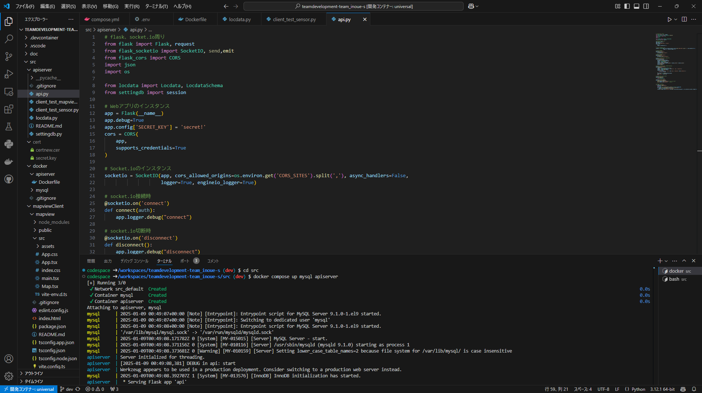
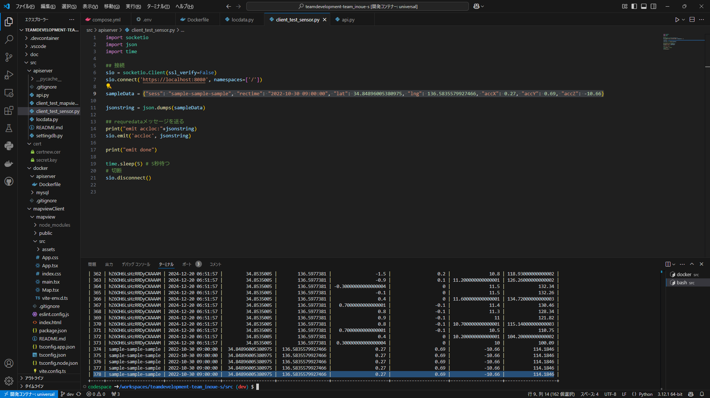
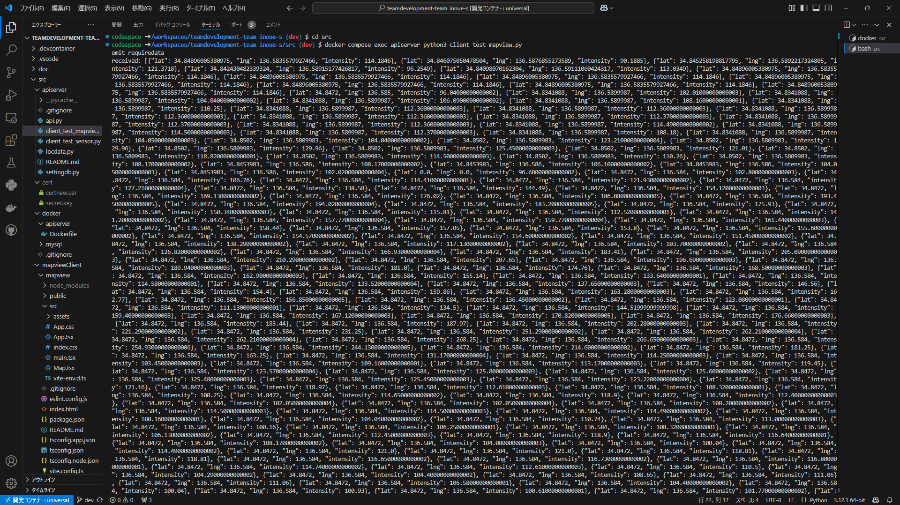
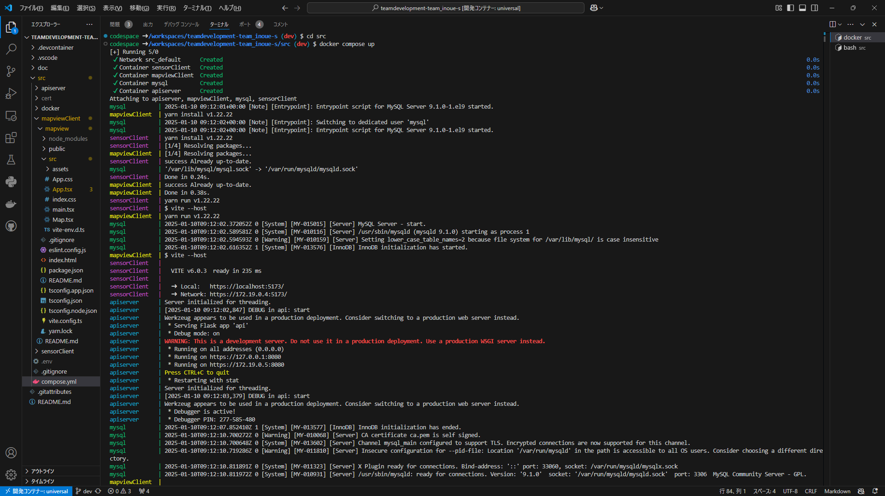
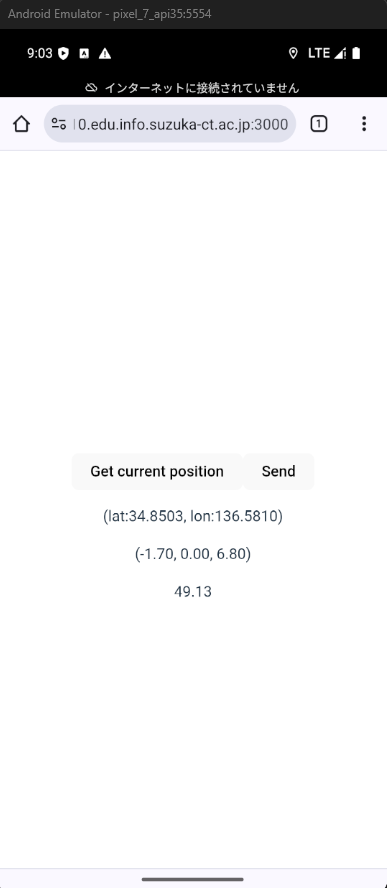
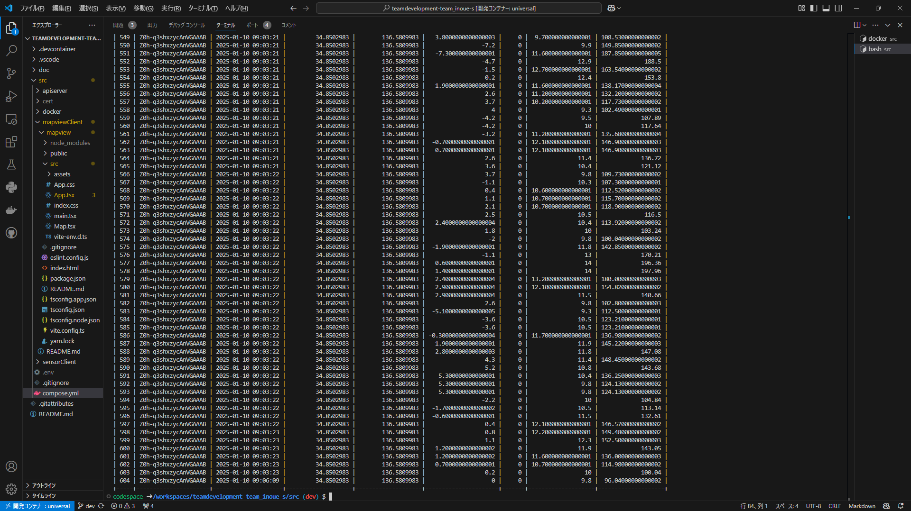
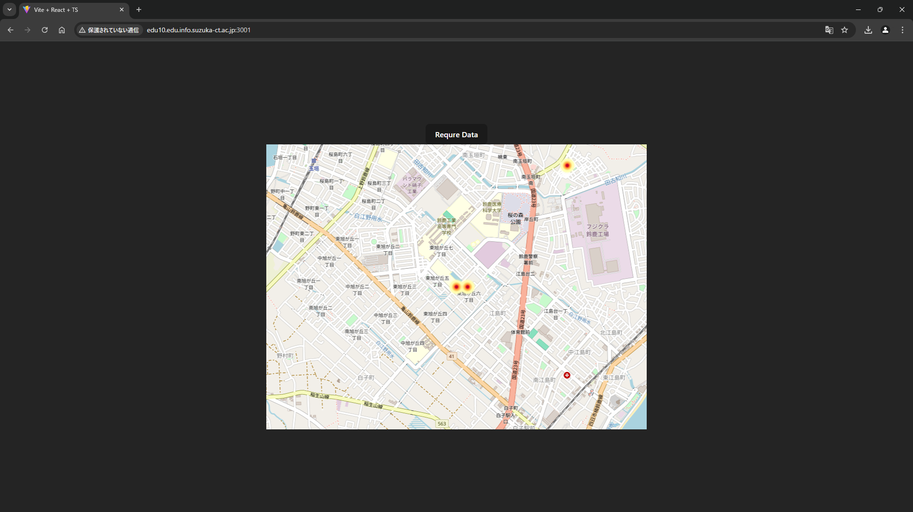
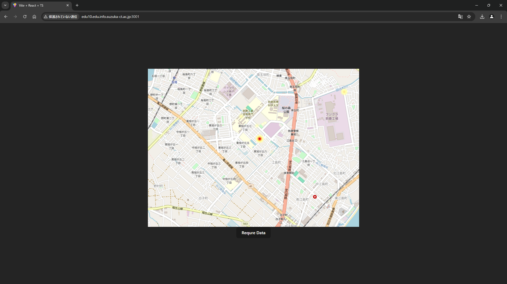

# チーム開発
3I14 公文健太

## 共同実験者
3I08 井上 高志  
3I20 杉本 隼都  
3I34 藤原 魁  

## 目的
- 一つのシステムを複数人からなるチームで構築するポイントや流れを理解する
- 一つのシステム(システムは複数のプログラムの集合体)を複数人で実装する経験を積む
- git/githubのpull requestを使ったコードレビューとマージの概念を理解し、実践する
- 開発だけではなく、運用を想定し、開発環境や使うツールの選定や整備を経験する

## 課題1
1. gitの練習(各々のブランチ作り、ブランチ間でPull Requestによりマージする場合)の考察
    - コンフリクトが発生した場合、どちらの変更点が正しいか、どちらも必要なのかを確認しコンフリクトを直す
    - ブランチ名をなんの作業をするブランチかわかりやすくする
    - 新しくブランチを作るとき、もとになっているものはどれなのか確認してから作成する
    - コミットをこまめに行い、gitに変更履歴を残す

## 課題2
1. 担当したパート  
    バックエンド

2. 自分の開発したパートのシステム概要、実装方法
    - 利用するコンポーネント
        - Web framework : flask
        - WebSocket platform : SocketIO
        - SQL DB : MySQL
        - Object Relational Mapper : SQLAlchemy
        - ORM/ODM/framework : marshmallow

    - システム概要
        - sensorClient - apiserver - mysql
            > sensorClientがLocdataを送信 -> apiserverがLocdataを受信 -> apiserverがmysqlにLocdataを格納
        - mapviewClient - apiserver - mysql
            > mapviewClientがヒートマップデータ要求 -> apiserverがmysqlからヒートマップデータを取得 -> apiserverがヒートマップデータを返す

    - 実装方法
        - sensorClientがLocdataを送信
            > *sensorClient側*
        - apiserverがLocdataを受信
            > `@socketio.on('accloc')` で、acclocメッセージを受信
        - apiserverがmysqlにLocdataを格納
            > `session.add(locdata)`  
            > `session.commit()` で格納
        - mapviewClientがヒートマップデータ要求
            > *mapviewClient側*
        - apiserverがmysqlからヒートマップデータを取得
            > `locdata = session.query(Locdata).all()` で取得して、  
            > `schema = LocdataSchema(many=True, only=('lat', 'lng', 'intensity'))` で緯度、経度、加速度絶対値のみを変換する
        - apiserverがヒートマップデータを返す
            > `emit('geoloc', jsonstring)` で送信する

3. 自分の開発したパートの確認方法と結果
    - 確認方法
        1. `docker compose up mysql apiserver` を実行しサーバーを立ち上げる 
        2. sensorClient
            1. `docker compose exec apiserver python3 client_test_sensor.py` を実行し、`'accloc'`メッセージを送信する
            2. `docker compose exec mysql mysql -u appuser -p'APPUSERPW_,aCh9h[a[V' appdb -e'select * from locdata'` を実行し、データベースにアクセスし、テストデータが挿入されているか確認する
        3. mapviewClient
            1. `docker compose exec apiserver python3 client_test_mapview.py` を実行し、`'requredata'`メッセージを送信し、サーバーから`'geoloc'`メッセージを受け取る
            2. ターミナルに表示されるデータが、緯度、経度、加速度絶対値のみでありデータベース内の値と一致するか確認する

    - 結果  
        1.  
              
        2.  
              
        3.  
              

4. チーム全体で作成したシステムの確認方法と結果
    - 確認方法
        1. `docker compose up` で、すべてのコンテナを起動
        2. sensorClient
            1. コマンドプロンプトで`emulator -avd pixel_7_api35`と入力し、Androidエミューレータを起動する
            2. AndroidエミュレータのChromeで`https://eduXX.edu.info.suzuka-ct.ac.jp:3000/`にアクセスする(XXは自分のPCのホスト名)
            3. AndroidエミュレータのLocationでGPSデータを読み込んで再生する
            4. AndroidエミュレータのVirtual sensorsのDevice Poseで動かす。
            5. アプリの`Start record GPS and Acc`をクリックし、加速度及び位置情報が変化していることを確認する
            6. `Send`をクリックしてAPIサーバにデータが送られるか確認する。

        3. mapviewClient
            1. WindowsのChromeで`https://eduXX.edu.info.suzuka-ct.ac.jp:3000/`にアクセスする(XXは自分のPCのホスト名)
            2. 地図が表示され、ヒートマップが表示されるか確認する
            3. `Require Data`をクリックし、ヒートマップがデータベースに保存された値によって更新されるか確認する

    - 結果  
        1.   
              
        2.   
            5.   
                  
            6.   
                  
        3.   
            2. 初期データ  
                  
            3. 更新後  
                

5. 実験を通じて気づいたチームで開発するときの注意点
    - コンフリクトが発生した場合、その部分の流れをコードを読み理解してから直す
    - なるべくコンフリクトが発生しないようにしっかり分担する
    - 分担の境界が薄い部分は開発者同士で話し合い、どのようにお互いが開発しようとしているのか理解しあう
    - 全体にかかわる変更点があった場合、しっかりと周知する

## 理解したこと、理解できていないこと
全体のコードを読むことで、フロントエンド、バックエンドの通信とデータの流れをどのような手法を使ってつなげているかが理解できた。担当したパートはバックエンドだが、通信するコードを書きながら、通信を送った先のコードも読むことで、フロントエンド部分の理解も深まった。そのため通信できないエラーが発生してもどちらに原因があるのかを特定することができた。awsの本番環境の部分はよくわからない部分が多く、理解できなかった。